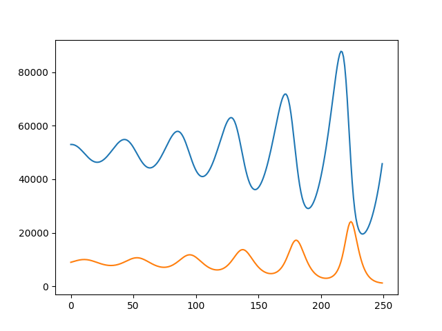

# une solution à Loka Voltera

Pour récursivité, impératif, générateur voir [LotkaVolterra.py](https://github.com/ISSAE/UTC503/blob/master/Solutions/RecursionFonctions/LotkaVolterra.py)

Rappel trés bref du problème:

* u: nombre de proies (par exemple, lapins)
* v: nombre de prédateurs (par exemple, renards)

a, b, c, d sont des paramètres constants définissant le comportement de la population:

* a est le taux de croissance naturel des lapins, quand il n'y a pas de renard
* b est le taux de mortalité naturelle des lapins, dû à la prédation
* c est le taux de mort naturel du renard, quand il n'y a pas de lapin
* d est le facteur décrivant le nombre de lapins capturés permettant de créer un nouveau renard

avec
> U(n+1) = U(n) * (1+a-bV(n))
> V(n+1) = V(n) * (1 -c + dU(n))

On obtient entre les temps 0 et 250 un courbe suivante:

# remarque
pour installer matplotlib

faire 

[Linux] : python3 -m pip install matplotlib

[Windows] python -m pip install matplotlib

lancer le programme python3 LotkaVolterra.py

vous obtiendrais les temps pour chacun des 3 algorithme